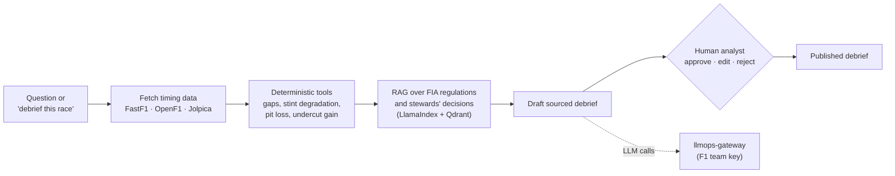

# f1-strategy-analyst

[](https://github.com/Mak5ens/f1-strategy-analyst/actions/workflows/ci.yml)
[](LICENSE)

**An AI agent that writes sourced Formula 1 race strategy debriefs from timing data and FIA regulations, pauses for a human analyst before publishing, and is gated by an evaluation CI.**

> Status: under construction. Work starts with milestone 4.1 (data and FIA corpus ingestion). See the [roadmap](#roadmap).

## Why

Ask *"Why did this driver lose two places at the second pit stop?"* or request the full debrief of a Grand Prix.
The agent fetches the data, computes, checks the rulebook, writes a debrief with sources, and a human analyst approves, corrects or rejects each point before it is published.

This is the **first tenant** of the [internal AI platform](#part-of-an-internal-ai-platform): every LLM call goes through the gateway with the F1 team's key and budget. It also builds the reusable foundation (agent skeleton, test set, evaluation CI) for the next tenants.

## How it works



- **Numbers never come from the LLM.** Lap gaps, degradation, pit loss and undercut gains are computed by deterministic, unit-tested tools. The LLM explains them.
- **Every claim is sourced**: a data point or a regulation article.
- **The agent knows when to stop.** A LangGraph interrupt pauses before publication; a PostgreSQL checkpointer lets a pending debrief resume later.

## Evaluation first

Quality is tested like code. Each pull request shows the scores and **fails below the thresholds**.

- **Test set**: 300 to 500 cases whose answer can be computed from real data, plus rulebook questions with a reference answer.
- **Tools**: promptfoo (extraction, computation, safety), Ragas (faithfulness, context recall), an LLM judge calibrated on 30 hand-graded debriefs, Langfuse Datasets for versioning.
- **Baseline**: a plain RAG is evaluated first and serves as the reference the agent has to beat.

## Stack

| Function | Tool |
| -- | -- |
| Agent | LangGraph, PostgreSQL checkpointer |
| Data | FastF1 (timing, stints, tyres, telemetry since 2018), OpenF1 (race control messages), Jolpica-F1 (history since 1950) |
| Ingestion and RAG | LlamaIndex, Qdrant |
| Evaluation | promptfoo, Ragas, LLM judge, Langfuse Datasets |
| Validation UI | FastAPI and a single page |
| LLM access | [llmops-gateway](https://github.com/Mak5ens/llmops-gateway) |

## Quick start

Not runnable yet. Target:

```bash
just up     # local services (Qdrant, PostgreSQL) and the agent
just test   # unit tests and evaluation suite
just down
```

To contribute today, install the git hooks (requires [just](https://just.systems/) and [pre-commit](https://pre-commit.com/)):

```bash
just hooks
just lint
```

## Roadmap

### Milestone 4: data, corpus and evaluation CI

- [ ] **4.1 Data and FIA corpus ingestion**: FastF1 / OpenF1 / Jolpica-F1 pipeline, sporting regulations and stewards' decisions indexed in Qdrant, deterministic tools with unit tests.
- [ ] **4.2 Test set and evaluation CI**: 300 to 500 cases, plain RAG baseline, promptfoo + Ragas + calibrated judge, blocking thresholds in GitHub Actions, a demo PR where a degraded prompt fails the CI. Article 4.

### Milestone 5: agent with human validation

- [ ] **5.1 LangGraph agent and human validation**: data → computation → RAG → drafting → interrupt; validation UI; deployed on the cluster behind the gateway.
- [ ] **5.2 Demo and measurements**: 2-minute video, full trace in Langfuse, agent vs plain RAG scores, share of points accepted without edits, 2 or 3 models compared on score, latency and cost per 1,000 questions. Article 5.

## Part of an internal AI platform

| Repo | Role |
| -- | -- |
| [llmops-gateway](https://github.com/Mak5ens/llmops-gateway) | Block 1: single entry point to LLMs, keys, budgets, anonymization, tracing |
| [llmops-platform](https://github.com/Mak5ens/llmops-platform) | Block 2: Kubernetes in GitOps, vLLM autoscaling, GPU observability, costs |
| **f1-strategy-analyst** (this repo) | Block 3: first tenant, an agent with RAG and an evaluation CI |

Write-ups coming on [maxence-labbe.fr](https://maxence-labbe.fr): article 4, *Tester une IA comme on teste du code*, and article 5, *Un agent IA qui sait s'arrêter pour demander*.

## Disclaimer

Unofficial project, not associated in any way with the Formula 1 companies. F1, FORMULA ONE and related marks are trademarks of Formula One Licensing B.V. Data comes from unofficial public sources and is used for non-commercial purposes only. No logos or brand assets are used.

## License

[MIT](LICENSE).
